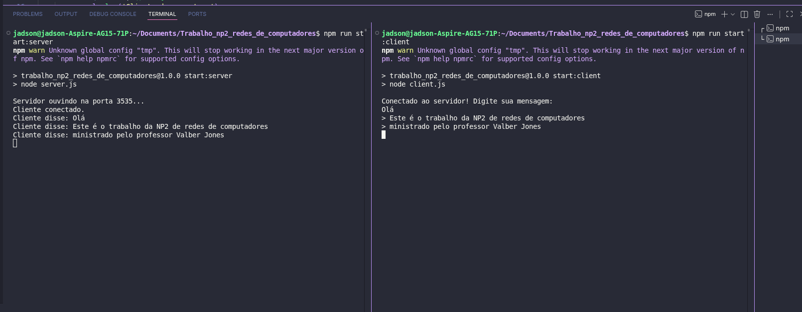

# Projeto de Comunicação via Sockets TCP

Este repositório contém uma implementação simples de comunicação entre dois processos usando sockets TCP em Node.js. O projeto foi desenvolvido como parte de uma atividade prática de redes de computadores e demonstra a troca de mensagens entre um cliente e um servidor.

## 📌 Visão geral

- **Servidor:** escuta conexões TCP na porta `3535` e exibe mensagens recebidas no terminal.
- **Cliente:** conecta-se ao servidor e permite ao usuário enviar mensagens via linha de comando.
- **Protocolo:** TCP usando o módulo `net` do Node.js.

## �️ Screenshot de demonstração



## �📁 Estrutura do projeto

- `server.js` - implementa o servidor TCP.
- `client.js` - implementa o cliente TCP.
- `package.json` - contém metadados do projeto e scripts de execução.
- `README.md` - documentação do projeto.

## ⚙️ Pré-requisitos

- Node.js instalado (versão 14 ou superior recomendada).

## 🚀 Como executar

1. Abra um terminal no diretório do projeto.
2. Inicie o servidor:
   ```bash
   npm run start:server
   ```
3. Em outro terminal, inicie o cliente:
   ```bash
   npm run start:client
   ```

## 🧪 Uso

- Após iniciar o cliente, digite uma mensagem e pressione `Enter`.
- A mensagem será enviada ao servidor e exibida no terminal do servidor.
- Para encerrar a sessão do cliente, digite:
  ```bash
  sair
  ```

## 🔍 Como funciona

### `server.js`

- Usa `net.createServer()` para criar um servidor TCP.
- Escuta em `127.0.0.1:3535`.
- Quando um cliente se conecta, exibe `Cliente conectado.`.
- Recebe dados do cliente pelo evento `data` e imprime a mensagem no console.
- Exibe `Cliente desconectou.` quando essa conexão é finalizada.

### `client.js`

- Cria um socket TCP com `new net.Socket()`.
- Conecta-se ao servidor em `127.0.0.1:3535`.
- Após conectar, cria um `readline.Interface` para ler entradas do usuário.
- Envia cada linha digitada pelo usuário ao servidor.
- Encerra a conexão quando o usuário digita `sair`.

## 📝 Scripts disponíveis

- `npm run start:server` - inicia o servidor.
- `npm run start:client` - inicia o cliente.
- `npm test` - script de teste padrão sem implementação.

## 💡 Possíveis melhorias

- Adicionar suporte a múltiplos clientes simultâneos.
- Implementar mensagens de resposta do servidor para o cliente.
- Adicionar tratamento de erros de conexão e reconexão.
- Usar TLS/SSL para comunicação segura.

## 📚 Referências

- [Documentação Node.js: módulo net](https://nodejs.org/api/net.html)
- [Conceitos de sockets TCP](https://en.wikipedia.org/wiki/Transmission_Control_Protocol)
